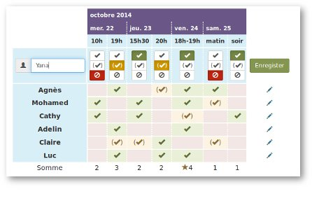

<!--
N.B.: This README was automatically generated by https://github.com/YunoHost/apps/tree/master/tools/README-generator
It shall NOT be edited by hand.
-->

# OpenSondage for YunoHost

[](https://dash.yunohost.org/appci/app/opensondage)    
[](https://install-app.yunohost.org/?app=opensondage)

*[Lire ce readme en français.](./README_fr.md)*

> *This package allows you to install OpenSondage quickly and simply on a YunoHost server.
If you don't have YunoHost, please consult [the guide](https://yunohost.org/#/install) to learn how to install it.*

## Overview

Service for planning an appointment or making a decision quickly and easily

**Shipped version:** 1.1.16~ynh1

**Demo:** https://framadate.org/

## Screenshots



## Disclaimers / important information

## Limitations

* There is no way to configure mail, either with smtp or with sendmail. See https://framagit.org/framasoft/framadate/merge_requests/184
* There is no way to use SSOWAT to identify current user. See https://framagit.org/framasoft/framadate/issues/177

## Additional information

* This package contains a custom version of Framadate (fork of OpenSondage and Studs), the sources are here: https://git.framasoft.org/framasoft/framadate/.

## Documentation and resources

* Official app website: https://framadate.org/
* Official user documentation: https://yunohost.org/#/app_opensondage
* Official admin documentation: https://framagit.org/framasoft/framadate/framadate/wikis/home
* Upstream app code repository: https://git.framasoft.org/framasoft/framadate
* YunoHost documentation for this app: https://yunohost.org/app_opensondage
* Report a bug: https://github.com/YunoHost-Apps/opensondage_ynh/issues

## Developer info

Please send your pull request to the [testing branch](https://github.com/YunoHost-Apps/opensondage_ynh/tree/testing).

To try the testing branch, please proceed like that.
```
sudo yunohost app install https://github.com/YunoHost-Apps/opensondage_ynh/tree/testing --debug
or
sudo yunohost app upgrade opensondage -u https://github.com/YunoHost-Apps/opensondage_ynh/tree/testing --debug
```

**More info regarding app packaging:** https://yunohost.org/packaging_apps